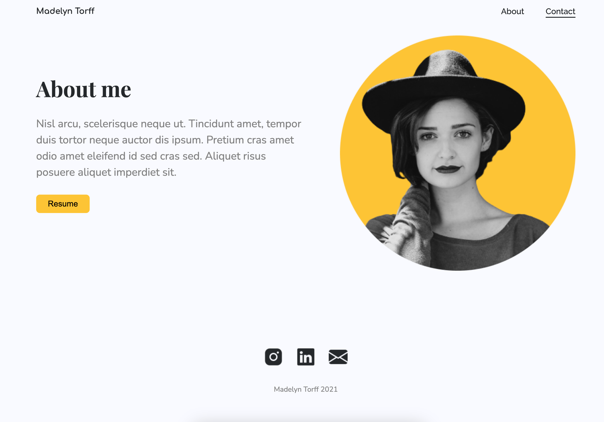

# Projekt - portfolio
[Kliknij tutaj aby rozwiązać zadanie](https://githubbox.com/Publishing-School/css-projekt-portfolio)

[Kliknij tutaj aby otworzyć makietę](https://www.figma.com/file/VhN5Xin4kMLDbXAowlsD7D/Personal-Portfolio-Website-Template-(Community)-(Copy)?type=design&node-id=0%3A1&mode=dev)

Rozwiązanie - strona główna

Rozwiązanie - strona kontakt

